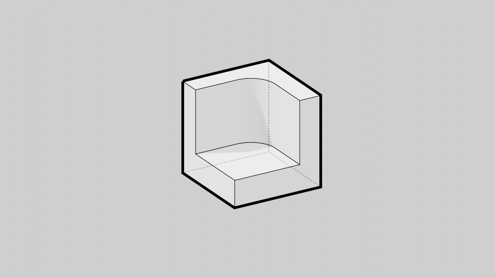
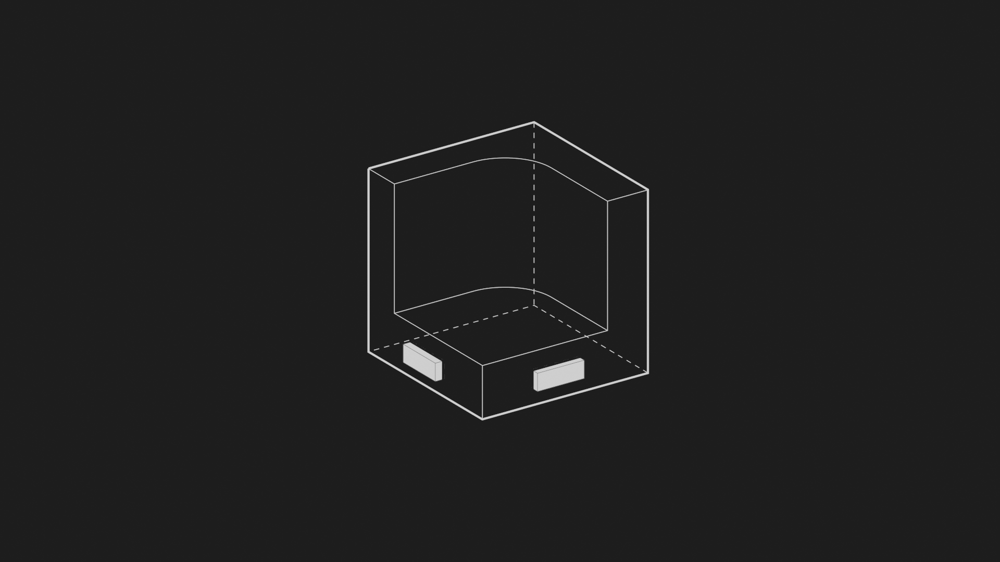

# Blender minimal Render 

Minimal blender render settings "Ikea-style" for your CAD project. 

* I have to finish writing this readme... just play with the files :) *

## Render Settings

By default, the scenes is rendered without the measures. However, it is possible to display the measures on the render. 

### Render with measures 
1. Render 
N -> View -> MeasureIt Tools

### Change lines properties

You can change the line properties under `View Layer properties` Tab > `Freestyle Line Set`

## Required addons 

* Freestyle
* Measure-It

## Export to STL

The file is setup for an easy export in STL. To export in STL, be sure to set scale to "10".

### Mist